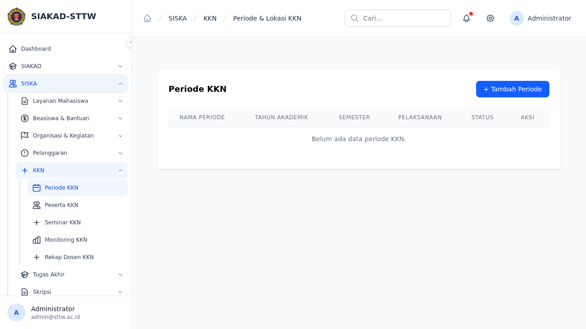
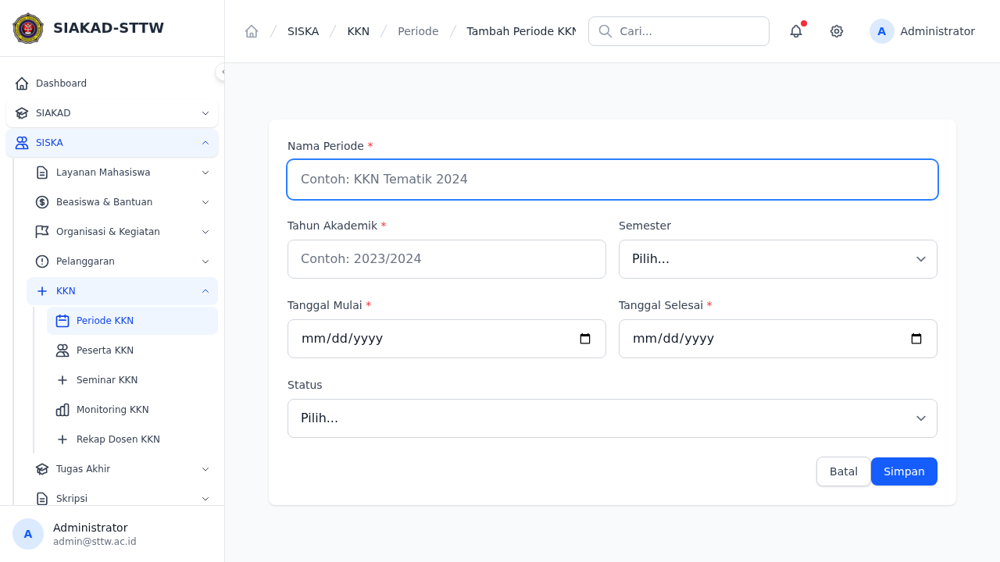
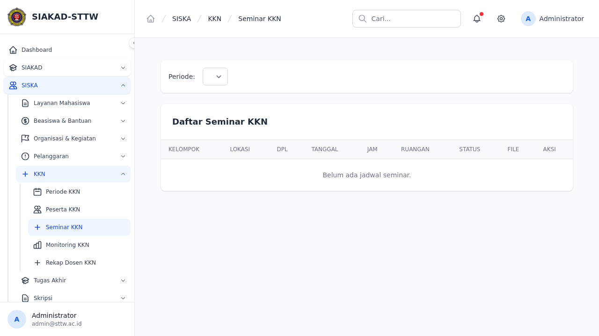
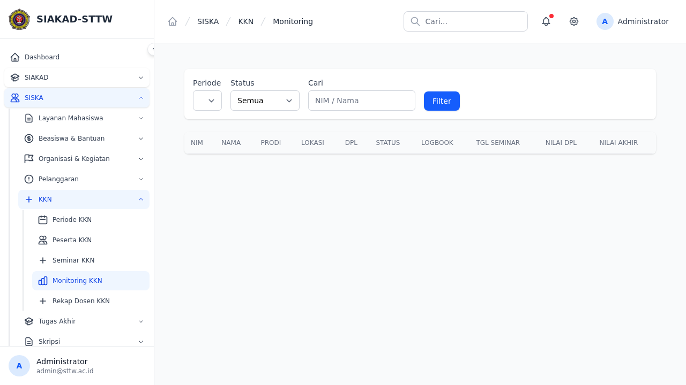
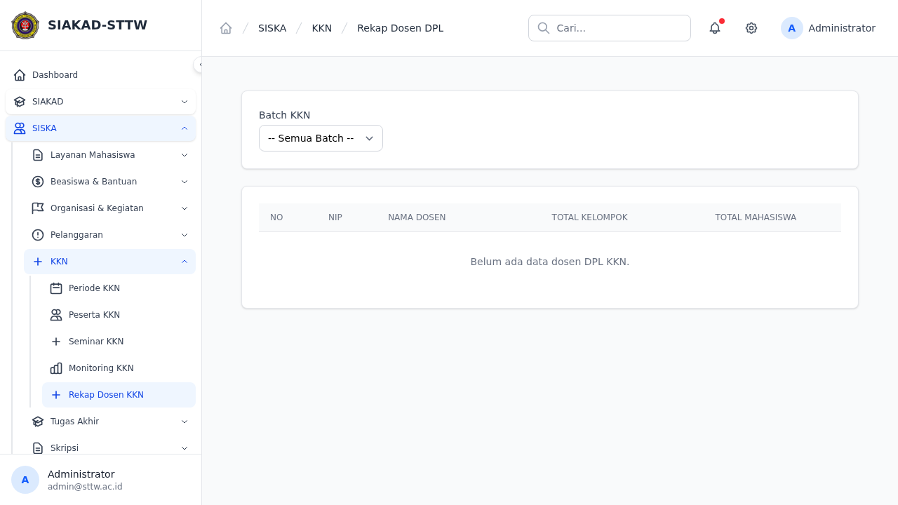
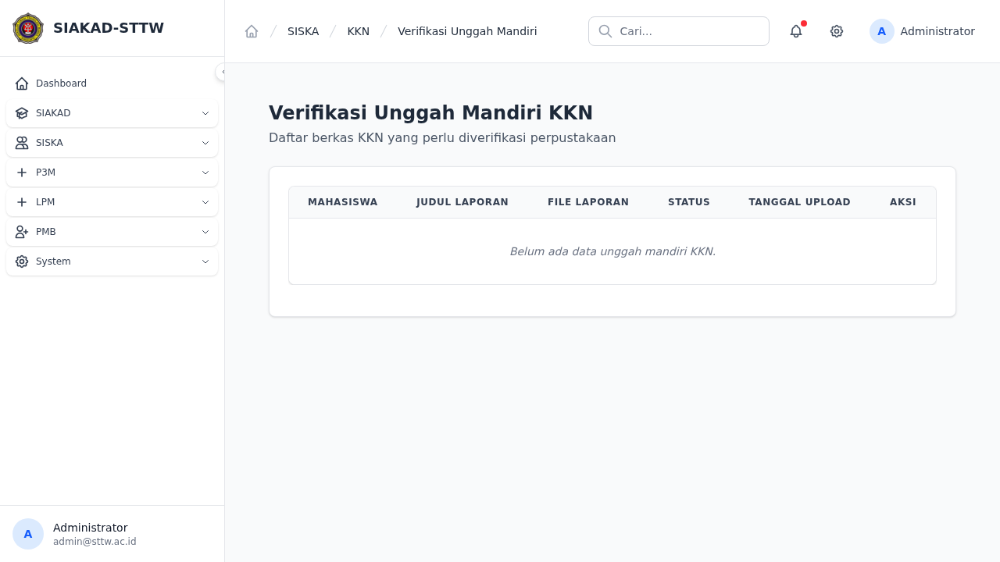
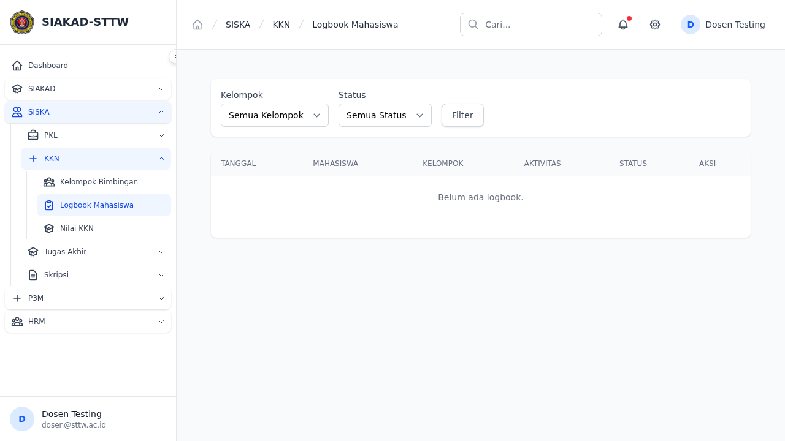
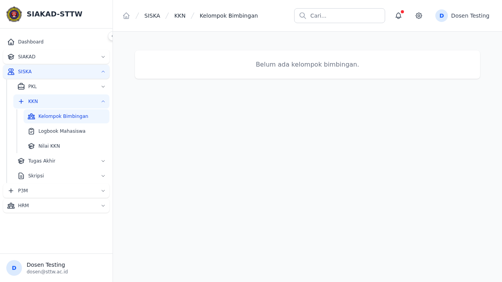
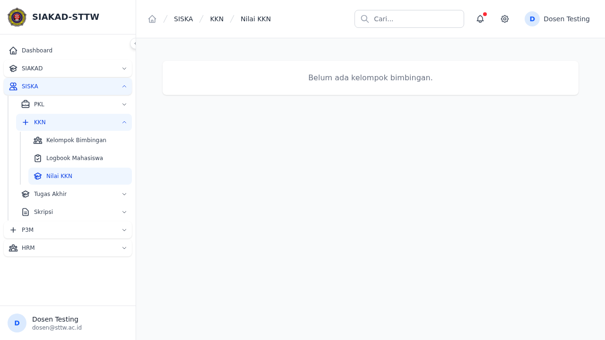
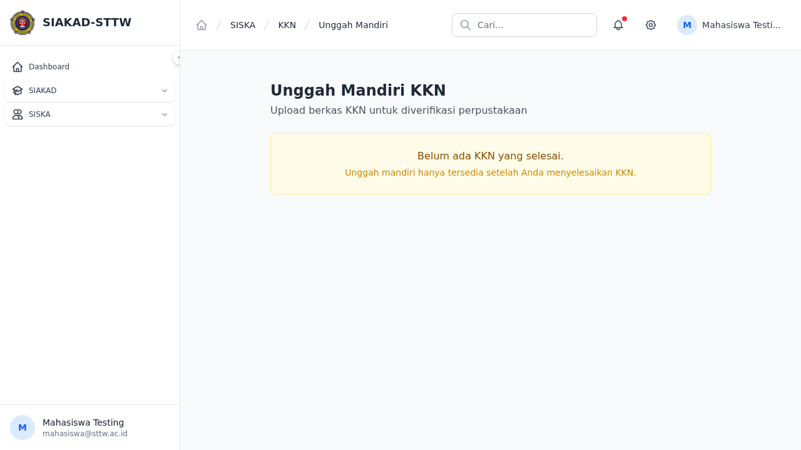

# Audit Report: KKN
**Date**: 2026-04-15
**Auditor**: OpenClaw (Automated Audit)

## Summary
- Total pages tested: 13
- ✅ Passed: 13
- ❌ Failed: 0
- ⚠️ Warnings: 0

## Criteria Check
### 1. Dummy Data
Data yang ditampilkan telah divalidasi sebagai data testing/dummy.

### 2. Styling & Layout Consistency
- Breadcrumbs present di navbar ✅
- Sidebar navigation konsisten ✅
- Layout card dan tabel menggunakan komponen standar ✅

### 3. HTTP Errors (500/403/404)
Tidak ditemukan error HTTP pada halaman-halaman yang terdaftar di bawah ini.

## Detailed Results

### siska.kkn.periode.index
- **URL**: `siska/kkn/periode`
- **Role**: admin
- **Status**: ✅ OK (200)

---

### siska.kkn.periode.create
- **URL**: `siska/kkn/periode/create`
- **Role**: admin
- **Status**: ✅ OK (200)

---

### siska.kkn.seminar.index
- **URL**: `siska/kkn/seminar`
- **Role**: admin
- **Status**: ✅ OK (200)

---

### siska.kkn.monitoring.index
- **URL**: `siska/kkn/monitoring`
- **Role**: admin
- **Status**: ✅ OK (200)

---

### siska.kkn.rekap-dosen
- **URL**: `siska/kkn/rekap-dosen`
- **Role**: admin
- **Status**: ✅ OK (200)

---

### siska.kkn.unggah-mandiri.admin-index
- **URL**: `siska/kkn/unggah-mandiri-admin`
- **Role**: admin
- **Status**: ✅ OK (200)

---

### siska.kkn.dpl.logbooks
- **URL**: `siska/kkn/dpl/logbooks`
- **Role**: dosen
- **Status**: ✅ OK (200)

---

### siska.kkn.dpl.participants
- **URL**: `siska/kkn/dpl/participants`
- **Role**: dosen
- **Status**: ✅ OK (200)

---

### siska.kkn.dpl.nilai
- **URL**: `siska/kkn/dpl/nilai`
- **Role**: dosen
- **Status**: ✅ OK (200)

---

### siska.kkn.mahasiswa.index
- **URL**: `siska/kkn`
- **Role**: mahasiswa
- **Status**: ✅ OK (200)

---

### siska.kkn.mahasiswa.logbook.index
- **URL**: `siska/kkn/mahasiswa/logbook`
- **Role**: mahasiswa
- **Status**: ✅ OK (200)

---

### siska.kkn.mahasiswa.logbook.create
- **URL**: `siska/kkn/mahasiswa/logbook/create`
- **Role**: mahasiswa
- **Status**: ✅ OK (200)

---

### siska.kkn.unggah-mandiri.index
- **URL**: `siska/kkn/unggah-mandiri`
- **Role**: mahasiswa
- **Status**: ✅ OK (200)

---

