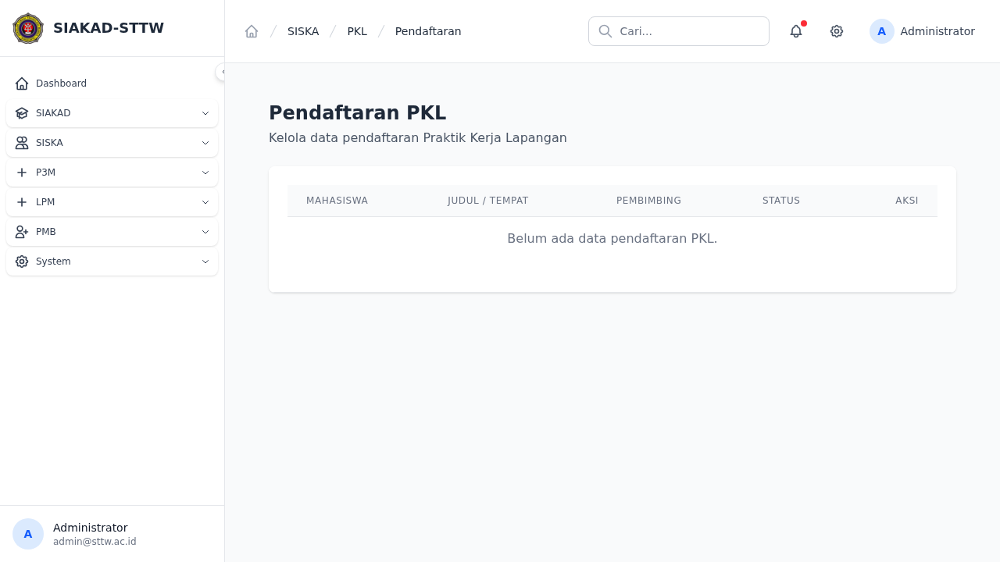
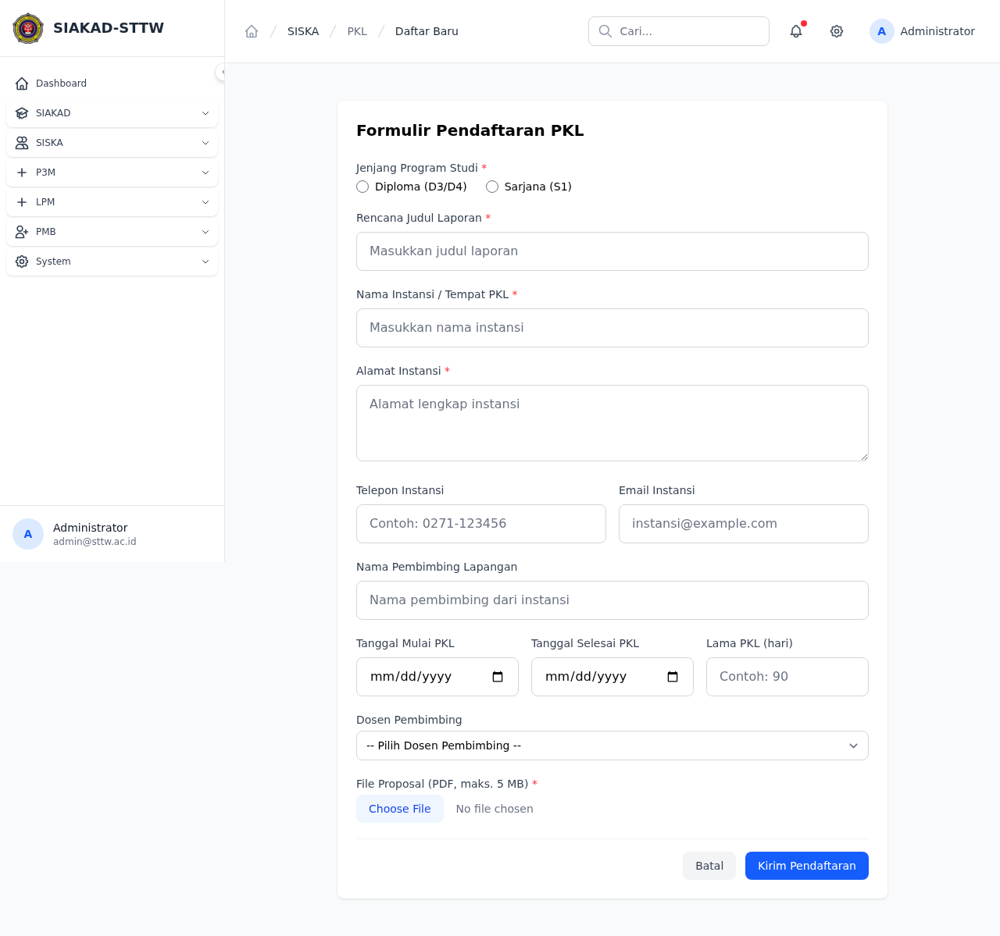
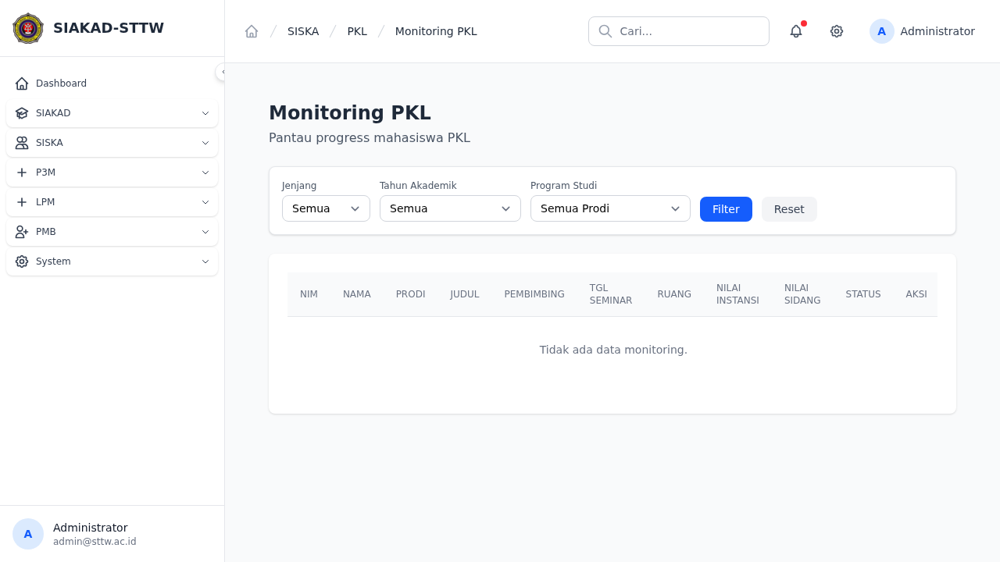
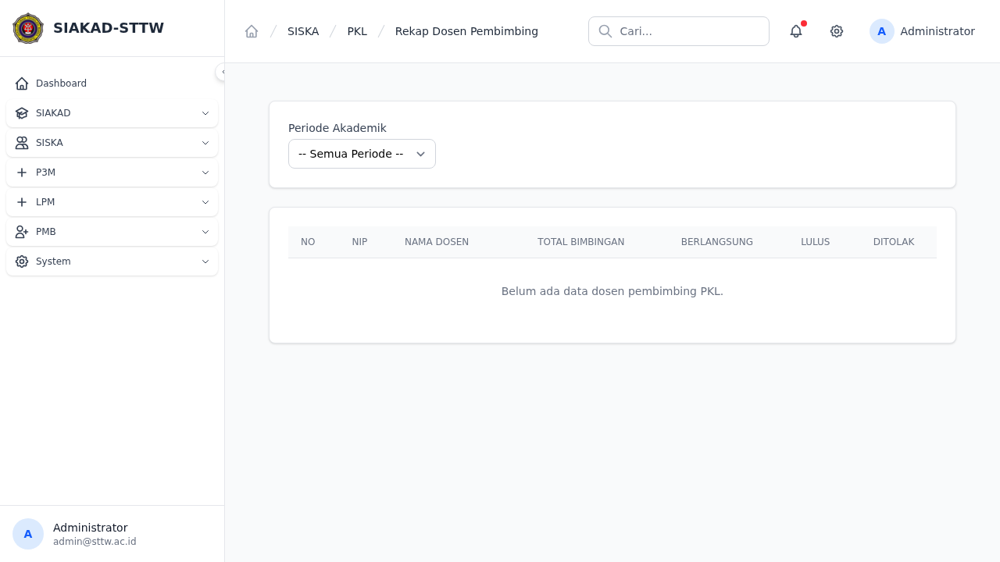
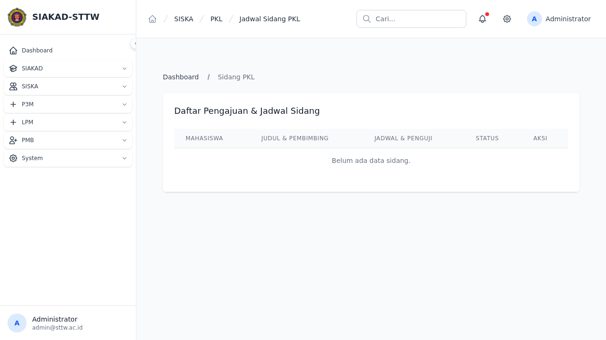
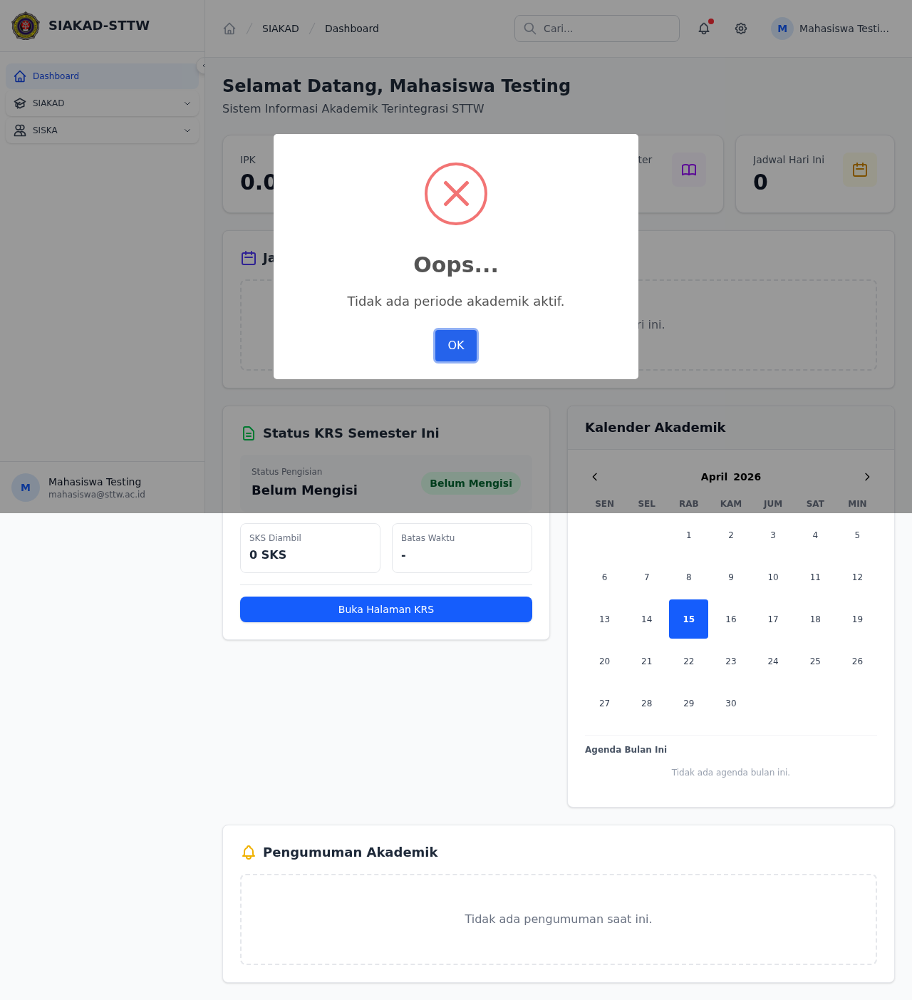
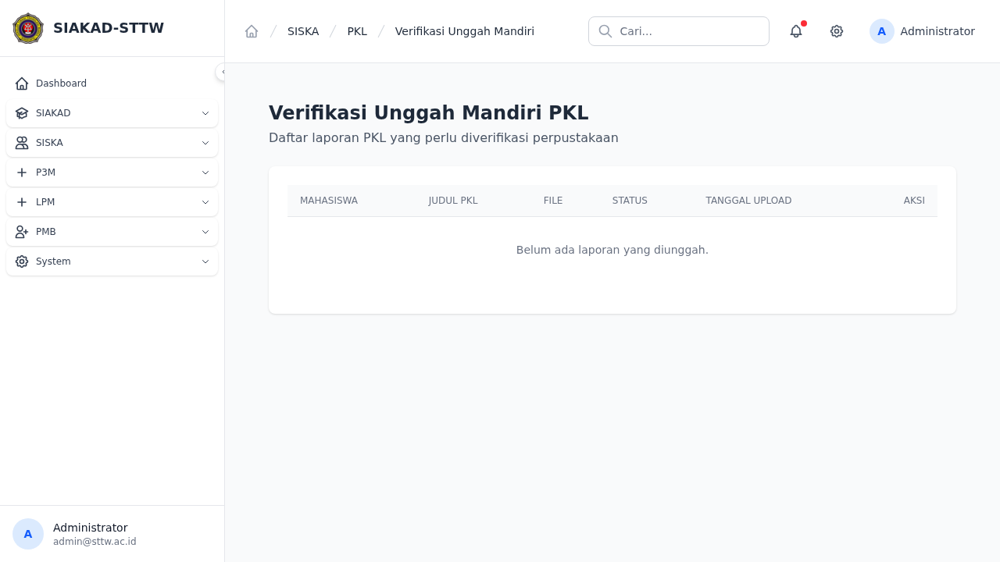

# Audit Report: PKL
**Date**: 2026-04-16
**Auditor**: OpenClaw (Automated Audit)

## Summary
- Total pages tested: 10
- ✅ Passed: 10
- ❌ Failed: 0
- ⚠️ Warnings: 0

## Criteria Check
### 1. Dummy Data
Data yang ditampilkan telah divalidasi sebagai data testing/dummy.

### 2. Styling & Layout Consistency
- Breadcrumbs present di navbar ✅
- Sidebar navigation konsisten ✅
- Layout card dan tabel menggunakan komponen standar ✅

### 3. HTTP Errors (500/403/404)
Tidak ditemukan error HTTP pada halaman-halaman yang terdaftar di bawah ini.

## Detailed Results

### siska.pkl.registrations.index
- **URL**: `siska/pkl/registrations`
- **Role**: admin
- **Status**: ✅ OK (200)

---

### siska.pkl.registrations.create
- **URL**: `siska/pkl/registrations/create`
- **Role**: admin
- **Status**: ✅ OK (200)

---

### siska.pkl.monitoring.index
- **URL**: `siska/pkl/monitoring`
- **Role**: admin
- **Status**: ✅ OK (200)

---

### siska.pkl.rekap-dosen
- **URL**: `siska/pkl/rekap-dosen`
- **Role**: admin
- **Status**: ✅ OK (200)

---

### siska.pkl.logbooks.index
- **URL**: `siska/pkl/logbooks`
- **Role**: mahasiswa
- **Status**: ✅ OK (200)

---

### siska.pkl.logbooks.create
- **URL**: `siska/pkl/logbooks/create`
- **Role**: mahasiswa
- **Status**: ✅ OK (200)

---

### siska.pkl.laporans.index
- **URL**: `siska/pkl/laporans`
- **Role**: mahasiswa
- **Status**: ✅ OK (200)

---

### siska.pkl.sidangs.index
- **URL**: `siska/pkl/sidangs`
- **Role**: admin
- **Status**: ✅ OK (200)

---

### siska.pkl.unggah-mandiri.index
- **URL**: `siska/pkl/unggah-mandiri`
- **Role**: mahasiswa
- **Status**: ✅ OK (200)

---

### siska.pkl.unggah-mandiri.admin-index
- **URL**: `siska/pkl/unggah-mandiri-admin`
- **Role**: admin
- **Status**: ✅ OK (200)

---

