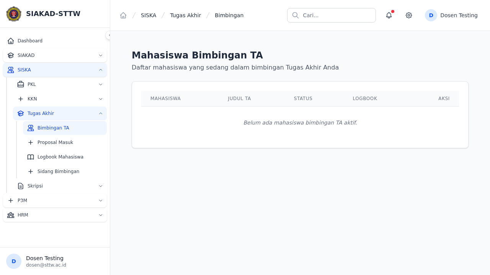
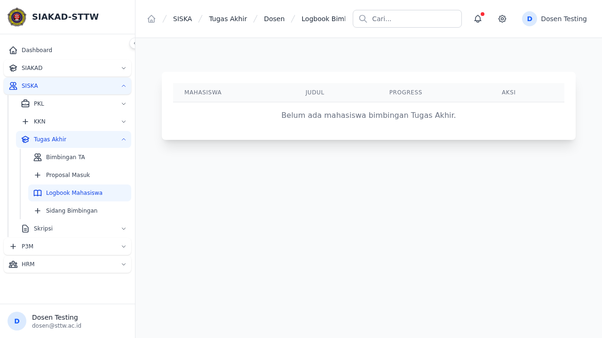
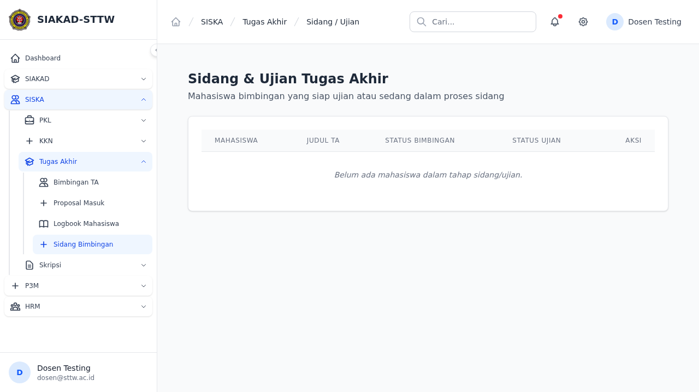
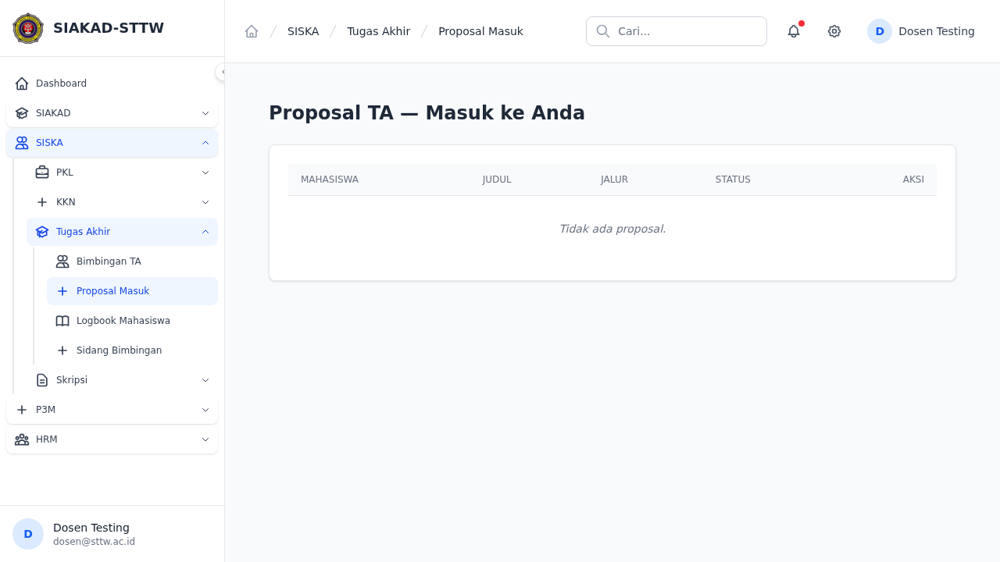
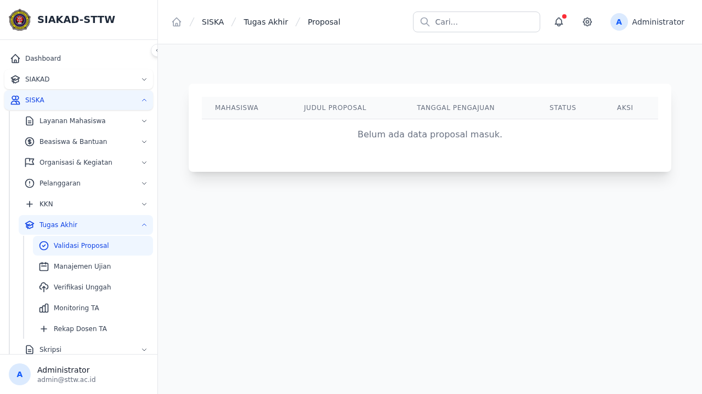
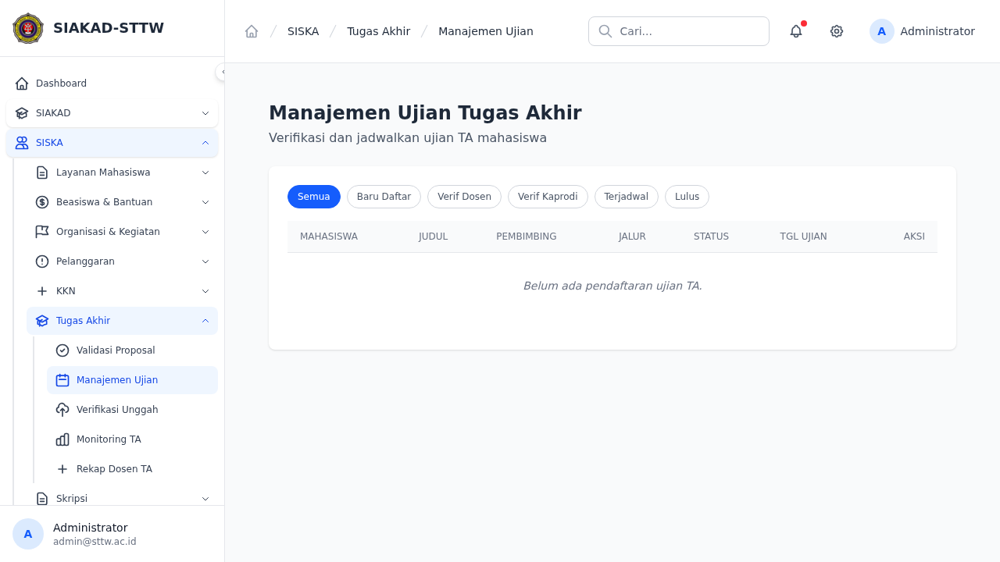
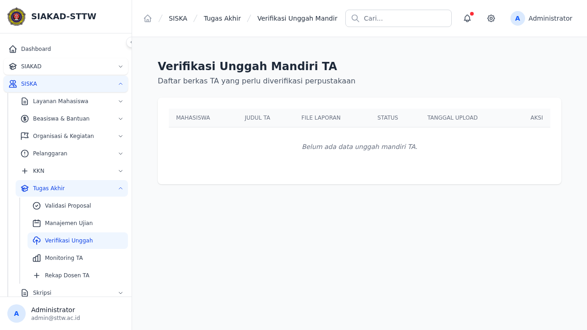
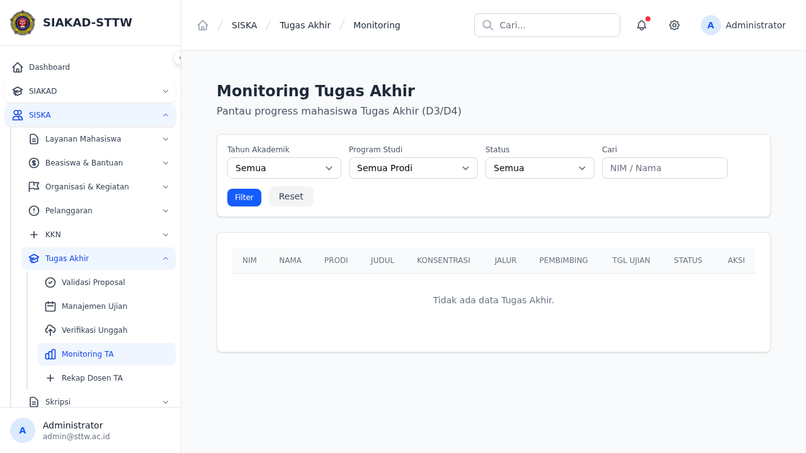
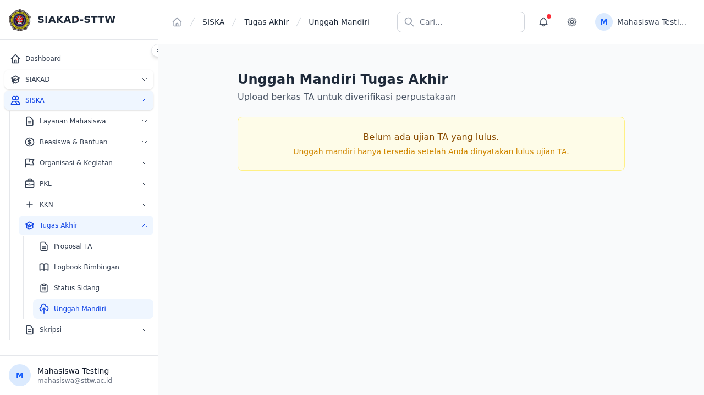

# Audit Report: TA
**Date**: 2026-04-15
**Auditor**: OpenClaw (Automated Audit)

## Summary
- Total pages tested: 15
- ✅ Passed: 15
- ❌ Failed: 0
- ⚠️ Warnings: 0

## Criteria Check
### 1. Dummy Data
Data yang ditampilkan telah divalidasi sebagai data testing/dummy.

### 2. Styling & Layout Consistency
- Breadcrumbs present di navbar ✅
- Sidebar navigation konsisten ✅
- Layout card dan tabel menggunakan komponen standar ✅

### 3. HTTP Errors (500/403/404)
Tidak ditemukan error HTTP pada halaman-halaman yang terdaftar di bawah ini.

## Detailed Results

### siska.ta.proposals.index
- **URL**: `siska/ta/proposals`
- **Role**: mahasiswa
- **Status**: ✅ OK (200)

---

### siska.ta.proposals.create
- **URL**: `siska/ta/proposals/create`
- **Role**: mahasiswa
- **Status**: ✅ OK (200)

---

### siska.ta.logbooks.index
- **URL**: `siska/ta/logbooks`
- **Role**: mahasiswa
- **Status**: ✅ OK (200)

---

### siska.ta.logbooks.create
- **URL**: `siska/ta/logbooks/create`
- **Role**: mahasiswa
- **Status**: ✅ OK (200)

---

### siska.ta.sidangs.index
- **URL**: `siska/ta/sidangs`
- **Role**: mahasiswa
- **Status**: ✅ OK (200)

---

### siska.ta.sidangs.create
- **URL**: `siska/ta/sidangs/create`
- **Role**: mahasiswa
- **Status**: ✅ OK (200)

---

### siska.ta.dosen.bimbingan.index
- **URL**: `siska/ta/dosen/bimbingan`
- **Role**: dosen
- **Status**: ✅ OK (200)

---

### siska.ta.dosen.logbooks.index
- **URL**: `siska/ta/dosen/logbooks`
- **Role**: dosen
- **Status**: ✅ OK (200)

---

### siska.ta.dosen.sidangs.index
- **URL**: `siska/ta/dosen/sidangs`
- **Role**: dosen
- **Status**: ✅ OK (200)

---

### siska.ta.dosen.proposals.index
- **URL**: `siska/ta/dosen/proposals`
- **Role**: dosen
- **Status**: ✅ OK (200)

---

### siska.ta.proposals.admin-index
- **URL**: `siska/ta/proposals-admin`
- **Role**: admin
- **Status**: ✅ OK (200)

---

### siska.ta.admin.ujians.index
- **URL**: `siska/ta/admin/ujians`
- **Role**: admin
- **Status**: ✅ OK (200)

---

### siska.ta.unggah-mandiri.admin-index
- **URL**: `siska/ta/unggah-mandiri-admin`
- **Role**: admin
- **Status**: ✅ OK (200)

---

### siska.ta.monitoring.index
- **URL**: `siska/ta/monitoring`
- **Role**: admin
- **Status**: ✅ OK (200)

---

### siska.ta.unggah-mandiri.index
- **URL**: `siska/ta/unggah-mandiri`
- **Role**: mahasiswa
- **Status**: ✅ OK (200)

---

